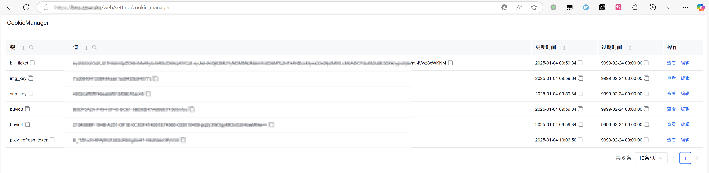
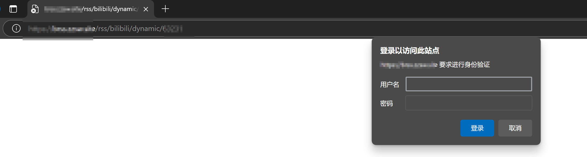

# bilibili-rss

~~B站/Pixiv~~ 通用 RSS 源生成服务。在部署完毕后，你可以通过访问该服务的地址；来订阅编写好抓取规则的网站的 RSS 源。

例如，你可以订阅 `https://you-domain.com/bilibili/dynamic/32708462` 这个地址来获取B站（bilibili）用户的动态信息。

## 项目特点

### 便捷的 cookie 管理

可以通过访问 web 管理界面直接查看、更新当前正在使用的 cookie 



### 可选开启的 Http 认证

开启 Http 认证后，访问该 RSS 服务需要通过认证后才能访问，可以保护需要登录才能访问的网站的私人数据。



## 已实现接口

---

### bilibili

#### 无需登录

- 用户动态：/bilibili/dynamic/{user_id}

---

### pixiv

#### 需登录

- 

---

## 部署方式

### Docker部署（推荐）

```shell
git clone https://github.com/VIILing/bilibili-rss.git
cd bilibili-rss
chmod u+x build_images.sh
./build_images.sh
sudo docker compose up -d
```

### 手动部署

手动部署需预先安装`python3.10`环境。

```shell
git clone https://github.com/VIILing/bilibili-rss.git
cd bilibili-rss
python3 -m venv venv
source venv/bin/activate
pip3 install -r requirements.txt
cd src
fastapi run main.py
```

## 参数设置

### Http 认证开启方式

在 `docker-compose.yml` 文件中取消掉以下注释，并将 xxx 替换为你设置好的账密数据。注意，若设置了空用户名或者空密码后， Http 认证将不会开启。

```
  web:
    image: VIILing/bilibili-rss:dev
    container_name: brss-web
    ports:
      - "12001:8000"
    volumes:
      - ./data:/app/src/data
#    environment:
#      - auth_user=xxx
#      - auth_pwd=xxx
```

### 缓存文件的挂载位置

默认缓存文件的挂在位置为启动目录下的 `data` 文件夹，可修改 `volumnes` 参数部分进行自定义。

## 鸣谢

感谢以下开源项目的无私奉献，是这些项目的存在促使了这个项目的诞生。

- [哔哩哔哩 - API 收集整理](https://github.com/SocialSisterYi/bilibili-API-collect)
- [PixivPy3](https://github.com/upbit/pixivpy)